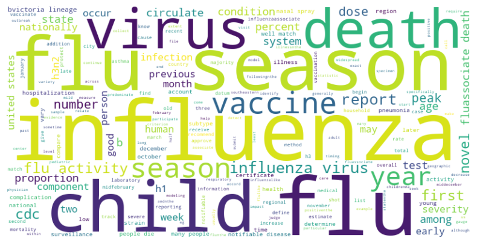

# Text-Summarization-for-Flu-Season-Summary-Reports

This project aims to create concise and informative summaries of flu season reports using advanced Natural Language Processing (NLP) techniques. The models used in this project include LexRank, TextRank, `facebook/bart-large-cnn`, and `google/pegasus-large`.

## Description

During the flu season, voluminous data is generated in the form of reports by healthcare providers, governments, and organizations. Analyzing these reports manually to extract useful information is time-consuming and labor-intensive. This project leverages state-of-the-art summarization models to automate the extraction of key insights from these reports, facilitating quicker decision-making and reporting.

## Models Used

- **LexRank**: An unsupervised approach to text summarization based on graph-based centrality scoring of sentences. Useful for its simplicity and effectiveness in identifying salient information.
- **TextRank**: Similar to LexRank, but uses a different approach for ranking sentences in the text, also unsupervised.
- **facebook/bart-large-cnn**: A powerful transformer-based model trained specifically for summarization tasks. Known for generating coherent and concise summaries.
- **google/pegasus-large**: Tailored for abstractive text summarization, this model was trained on a variety of web text sources and aims to generate more fluent summaries.
